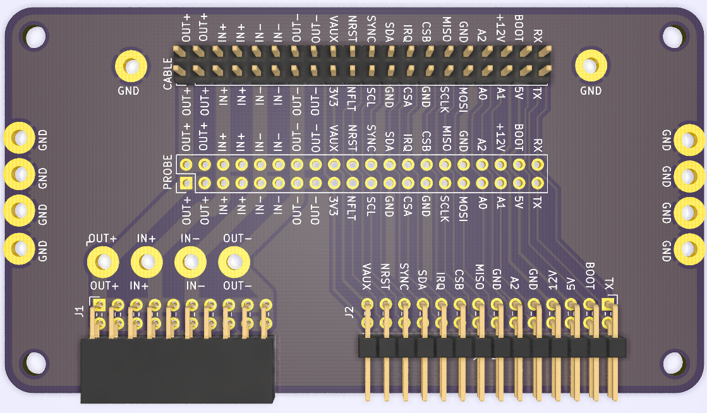

# DIB V1 extension

Extension for module prototyping, or debuging existing modules.

Connect first extension board to BB3 back plane.

Connect second extension board to module.

Connect extension boards with 40 pin IDE cable.

